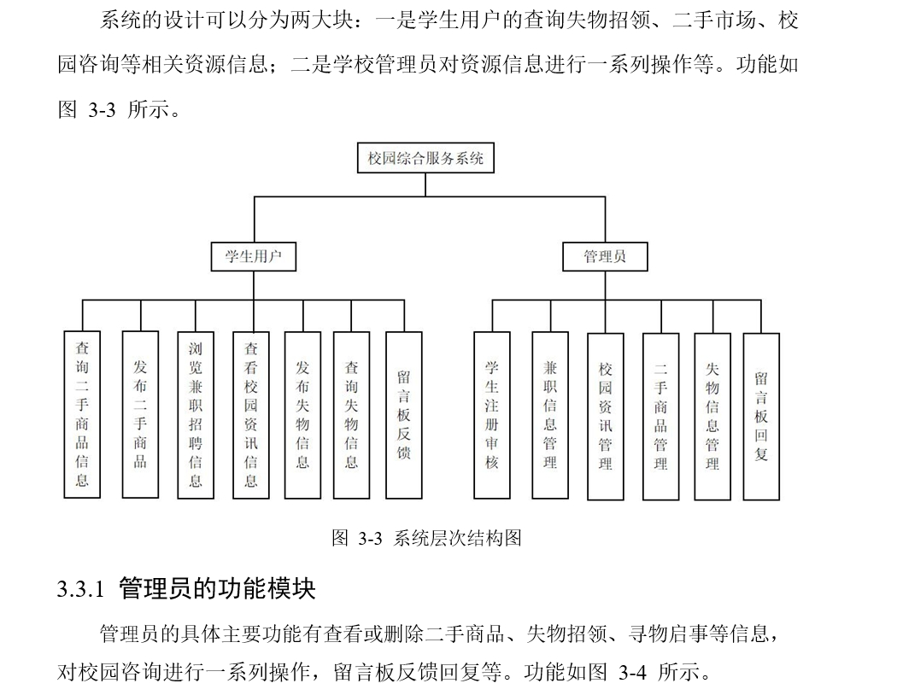
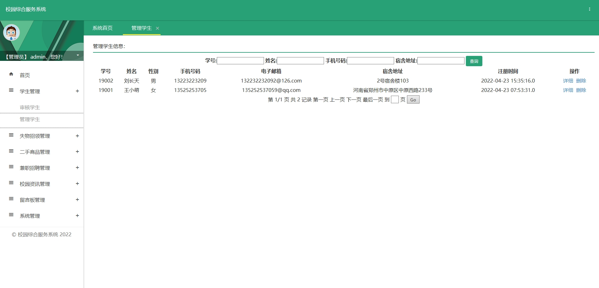
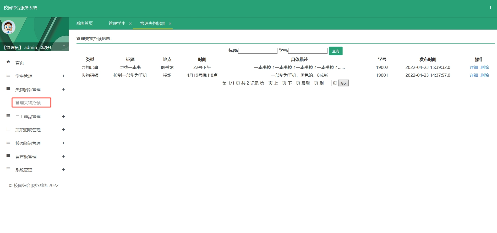
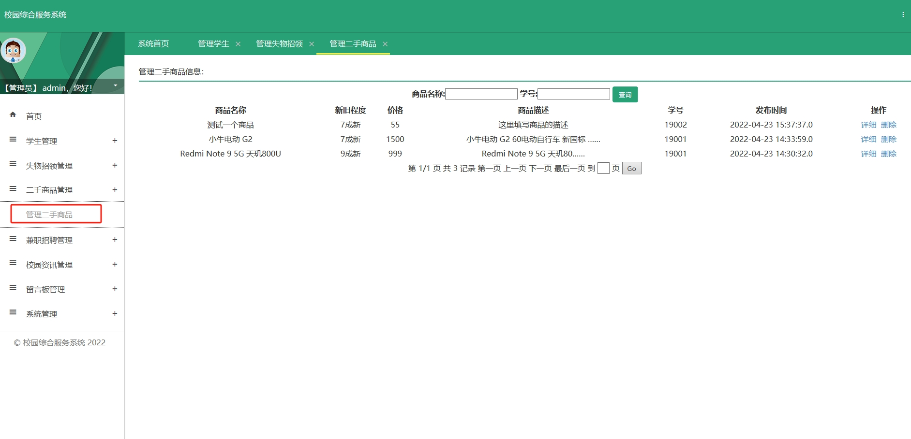
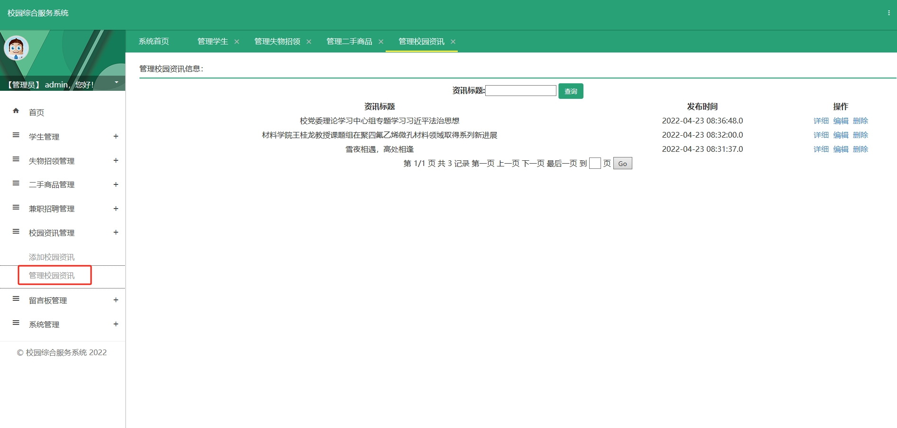
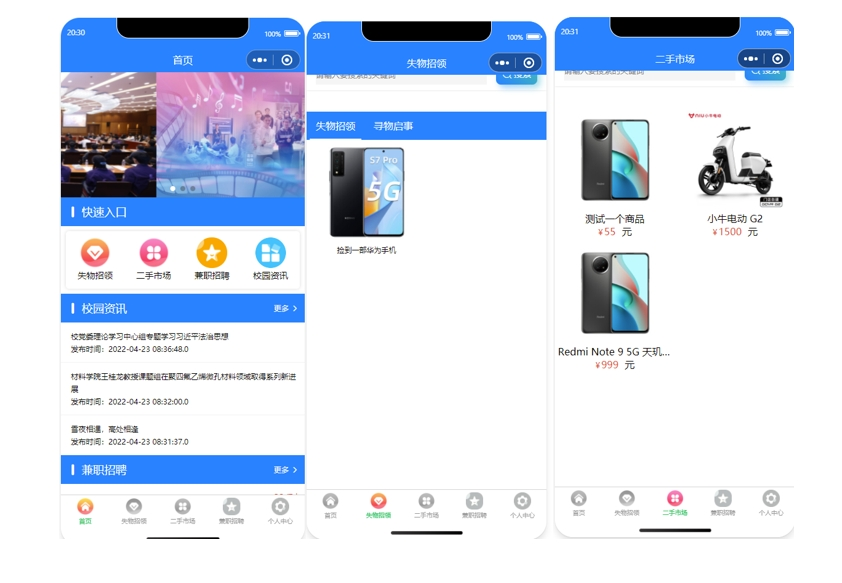
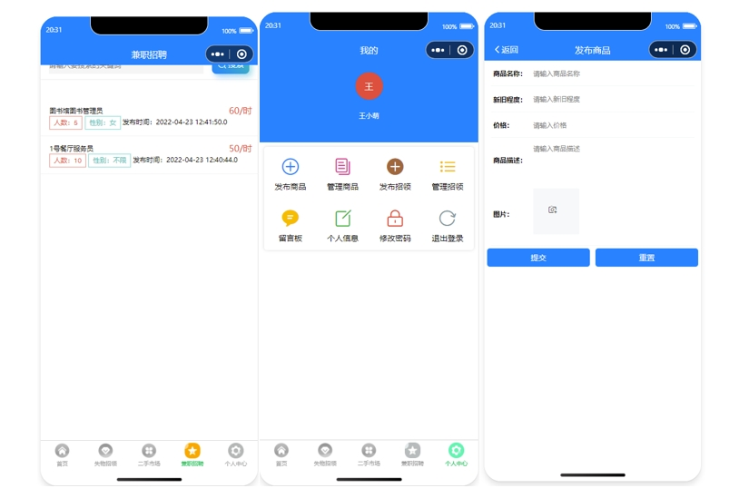
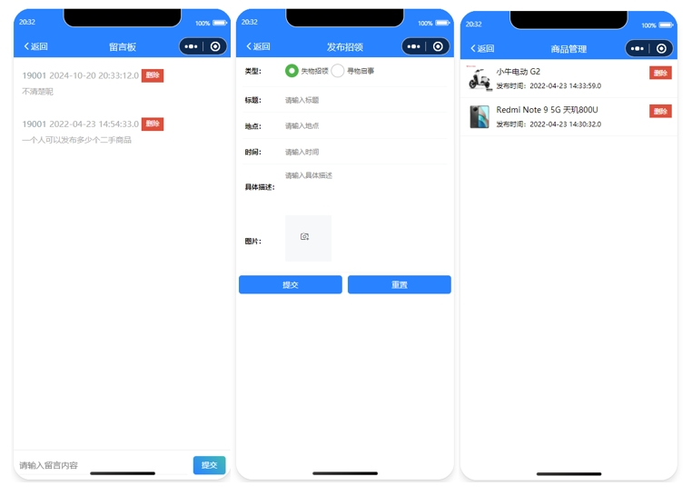
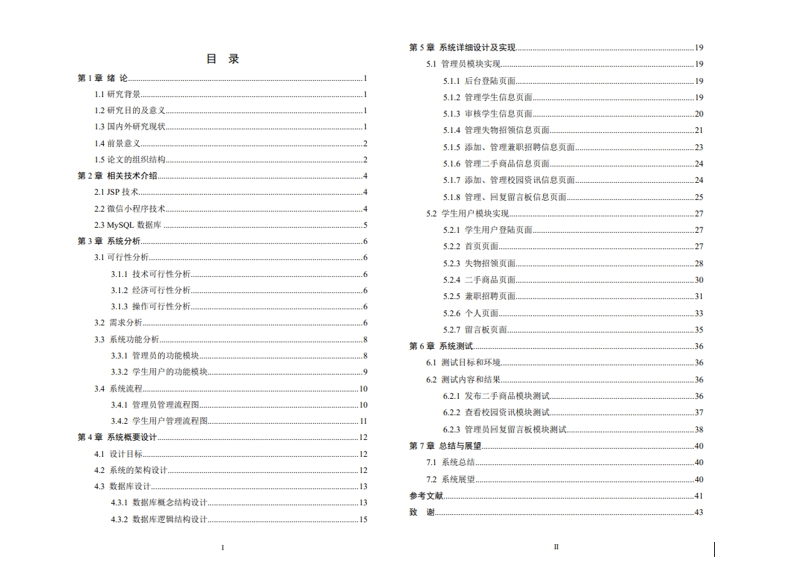

# 1.项目介绍
测试环境: IDEA2022, MySQL5.7+，Tomcat8.5

技术栈：JavaWeb，jsp

功能模块：学生管理、兼职管理、资讯管理、二手商品管理、失物招领管理、留言板等

功能角色：学生，管理员

# 2.项目部署
## 2.1 后端
- 通过Navicat创建数据库，编码utf8mb4
- 导入project\zonghefuwuServer\db目录下的sql文件
- 根据本地数据库环境，修改src/com/db/conn.java  19,24-27行
- 配置tomcat，其中deployment的ApplicationContext配置为/zonghefuwuServer（和小程序请求url一致就行）
- 启动tomcat，http://localhost:8080/zonghefuwuServer 管理员账号密码： admin/123456
## 2.2 小程序部署
- 微信开发工具打开zonghefuwu
- appid选择测试号即可
- 运行，登录账号自行查询数据库
# 3.项目部分截图

# 4.获取方式
[戳我查看](https://gitee.com/aven999/mall)     